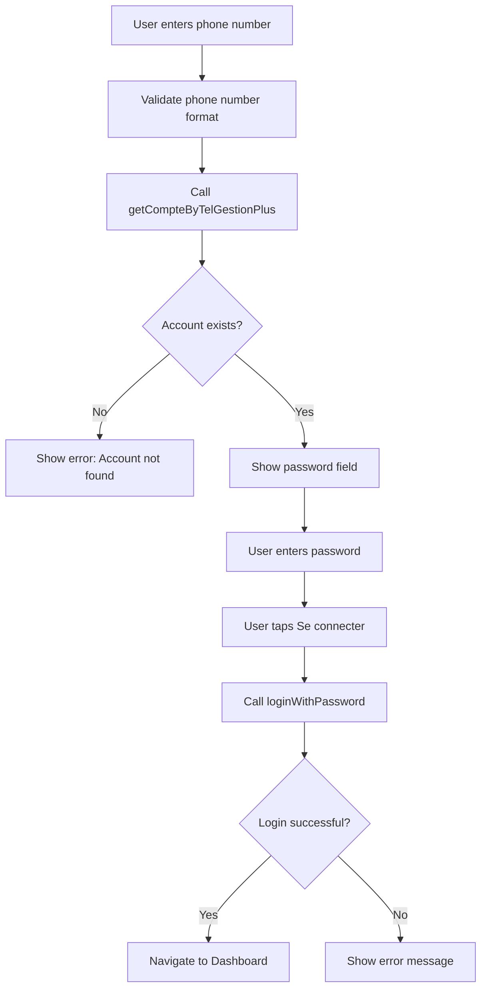

# Authentication Flow Refactoring Plan: Password-Only Migration

## Executive Summary

This document provides a focused implementation plan for migrating **password-only authentication** from `LoginScreen` to `LoginPassPinScreen`. The PIN authentication feature will be implemented later from the old app.

---

## 1. Current State Analysis

### 1.1 LoginScreen Architecture (Source)

**File:** [`lib/connection/login_screen/login_screen.dart`](lib/connection/login_screen/login_screen.dart)

The `LoginScreen` implements a two-step authentication flow:

1. **Phone number input** - User enters phone number
2. **Phone validation** - Calls `getCompteByTelGestionPlus()` to check if account exists
3. **Password field appears** - After valid phone number and account exists check
4. **Login** - Calls `loginWithPassword()` on AuthProvider

**Key Logic in [`login_screen_provider.dart`](lib/connection/login_screen/provider/login_screen_provider.dart):**

```dart
// Phone validation flow
Future<dynamic> getCompteByTelGestionPlus(String tel) async {
  final compte = await _authProvider?.getCompteByTelGestionPlus(tel);
  
  if (compte == null) {
    bAccountExists = false;
    updateErrorMessage("key_no_account_with".tr);
  } else {
    bUpdatePassActions = compte["actions"]?.contains("UPDATE_PASSWORD") ?? false;
    bAccountExists = true;
  }
  notifyListeners();
}

// Phone number validation
bool get isPhoneNumberValid {
  return _phoneNumber.trim().isNotEmpty &&
      _phoneNumber.length >= 8 &&
      isValidTunisianMobile(_phoneNumber);
}

// Password login
Future<bool> loginWithPassword(BuildContext context) async {
  final success = await authProvider?.loginWithPassword(
    context,
    _phoneNumber,
    _password,
  );
  if (success) clearForm();
  return success;
}
```

### 1.2 LoginPassPinScreen Issues (Target)

**File:** [`lib/connection/login_pass_pin_screen/login_pass_pin_screen.dart`](lib/connection/login_pass_pin_screen/login_pass_pin_screen.dart)

**Critical Issues:**
1. **Line 570:** `provider` variable referenced but not in scope in `_buildPasswordModeContent()`
2. **Lines 54-56:** PIN keypad validation only prints to console
3. **Lines 663-665:** Password validation button only prints to console
4. **No field clearing:** Phone number change doesn't clear password field
5. **No error display:** Missing proper error message handling

---

## 2. Migration Scope

### 2.1 What Will Be Implemented Now (Password Only)

✅ Phone number input with validation  
✅ Account existence check via `getCompteByTelGestionPlus()`  
✅ Password input with visibility toggle  
✅ Login button connected to `loginWithPassword()`  
✅ Error message display  
✅ Field clearing on phone number change  

### 2.2 What Will Be Deferred (PIN Authentication)

⏳ PIN keypad UI (keep as-is, non-functional)  
⏳ PIN login logic (implement later from old app)  
⏳ PIN/account existence validation  

---

## 3. Step-by-Step Implementation Plan

### Phase 1: Fix LoginPassPinProvider

**File:** [`lib/connection/login_pass_pin_screen/provider/login_pass_pin_provider.dart`](lib/connection/login_pass_pin_screen/provider/login_pass_pin_provider.dart)

**Changes Required:**

1. **Fix duplicate variable issue in `getCompteByTelGestionPlus`:**

```dart
Future<dynamic> getCompteByTelGestionPlus(String tel) async {
  try {
    clearErrors();
    final result = await _authProvider?.getCompteByTelGestionPlus(tel);

    if (result == null) {
      bAccountExists = false;
      loginScreenModel.errorMessage = "key_no_account_with".tr;
    } else {
      bUpdatePassActions = false;
      if (result["actions"] != null) {
        bUpdatePassActions = result["actions"].contains("UPDATE_PASSWORD");
      }
      bAccountExists = true;
    }
  } catch (e) {
    debugPrint('Error checking account: $e');
    return null;
  }
  notifyListeners();
}
```

2. **Add missing `loginWithPassword` method:**

```dart
Future<bool> loginWithPassword(BuildContext context) async {
  try {
    if (_phoneNumber.trim().isEmpty) {
      _phoneNumberError = 'Veuillez entrer votre numéro de téléphone';
      notifyListeners();
      return false;
    }

    if (_password.isEmpty) {
      _passwordError = 'Veuillez entrer votre mot de passe';
      notifyListeners();
      return false;
    }

    if (_authProvider == null) {
      loginScreenModel.errorMessage = 'Service d\'authentification non disponible';
      notifyListeners();
      return false;
    }

    final success = await _authProvider!.loginWithPassword(
      context,
      _phoneNumber,
      _password,
    );

    if (success) {
      clearForm();
    } else {
      loginScreenModel.errorMessage = _authProvider?.errorMessage;
    }

    notifyListeners();
    return success;
  } catch (e) {
    debugPrint('Login with password error: $e');
    loginScreenModel.errorMessage = 'Erreur de connexion';
    notifyListeners();
    return false;
  }
}
```

3. **Add `isPhoneNumberValid` getter:**

```dart
bool get isPhoneNumberValid {
  return _phoneNumber.trim().isNotEmpty &&
      _phoneNumber.length >= 8 &&
      isValidTunisianMobile(_phoneNumber);
}
```

4. **Add `clearPassword` method:**

```dart
void clearPassword() {
  _password = '';
  _passwordError = null;
  loginScreenModel.passwordController = '';
  notifyListeners();
}
```

5. **Add `updateErrorMessage` method:**

```dart
void updateErrorMessage(String? errorMessage) {
  loginScreenModel.errorMessage = errorMessage;
  if (errorMessage == null) {
    _authProvider?.clearError();
  }
  notifyListeners();
}
```

### Phase 2: Fix LoginPassPinScreen

**File:** [`lib/connection/login_pass_pin_screen/login_pass_pin_screen.dart`](lib/connection/login_pass_pin_screen/login_pass_pin_screen.dart)

**Changes Required:**

1. **Add error display widget after phone input section:**

```dart
/// Section Widget: Error Message
Widget _buildErrorMessage(LoginPassPinProvider provider) {
  final errorMessage = provider.loginScreenModel.errorMessage;
  if (errorMessage == null) return const SizedBox.shrink();

  return Container(
    margin: EdgeInsets.only(top: 8.h),
    padding: EdgeInsets.all(12.h),
    decoration: BoxDecoration(
      color: appTheme.errorContainer,
      borderRadius: BorderRadius.circular(8.h),
      border: Border.all(
        color: appTheme.errorColor.withOpacity(0.5),
        width: 1.h,
      ),
    ),
    child: Row(
      children: [
        Icon(Icons.error_outline, color: appTheme.errorColor, size: 20.h),
        SizedBox(width: 8.h),
        Expanded(
          child: Text(
            errorMessage,
            style: TextStyleHelper.instance.body14RegularSyne.copyWith(
              color: appTheme.errorColor,
            ),
          ),
        ),
      ],
    ),
  );
}
```

2. **Fix `_buildPasswordModeContent` to use provider from Consumer:**

```dart
/// Section Widget: Password Mode Content
Widget _buildPasswordModeContent() {
  return Consumer<LoginPassPinProvider>(
    builder: (context, provider, child) {
      return Column(
        children: [
          Text(
            'Saisir votre mot de passe *',
            style: TextStyleHelper.instance.body14RegularSyne.copyWith(
              color: appTheme.onSurfaceVariant,
            ),
          ),
          SizedBox(height: 8.h),
          _buildPasswordTextField(provider),
          SizedBox(height: 16.h),
          if (provider.isPhoneNumberValid && (provider.bAccountExists ?? false))
            _buildForgotPasswordLink(provider),
          SizedBox(height: 30.h),
          _buildValidateButton(provider),
        ],
      );
    },
  );
}
```

3. **Update `_buildPasswordTextField` to connect to provider:**

```dart
/// Section Widget: Password Text Field
Widget _buildPasswordTextField(LoginPassPinProvider provider) {
  return SizedBox(
    height: kInputFieldHeight.h,
    child: TextField(
      controller: _passwordController,
      obscureText: _obscurePassword,
      style: TextStyleHelper.instance.body14RegularSyne.copyWith(
        color: appTheme.onBackground,
        fontSize: 14.fSize,
      ),
      decoration: InputDecoration(
        hintText: 'Entrez votre mot de passe',
        hintStyle: TextStyleHelper.instance.body14RegularSyne.copyWith(
          color: appTheme.onSurfaceVariant,
          fontSize: 14.fSize,
        ),
        prefixIcon: Container(
          padding: EdgeInsets.symmetric(horizontal: 12.h),
          child: Icon(
            Icons.lock_outline,
            color: appTheme.onSurfaceVariant,
            size: 20.h,
          ),
        ),
        prefixIconConstraints: BoxConstraints(maxHeight: kInputFieldHeight.h),
        suffixIcon: IconButton(
          icon: Icon(
            _obscurePassword ? Icons.visibility_off : Icons.visibility,
            color: appTheme.onSurfaceVariant,
            size: 20.h,
          ),
          onPressed: () {
            setState(() {
              _obscurePassword = !_obscurePassword;
            });
          },
          constraints: BoxConstraints(
            minWidth: kTouchTargetMin.h,
            minHeight: kTouchTargetMin.h,
          ),
          splashRadius: 20.h,
        ),
        contentPadding: EdgeInsets.symmetric(
          horizontal: 16.h,
          vertical: 18.h,
        ),
        border: OutlineInputBorder(
          borderRadius: BorderRadius.circular(12.h),
          borderSide: BorderSide(color: appTheme.borderColor),
        ),
        enabledBorder: OutlineInputBorder(
          borderRadius: BorderRadius.circular(12.h),
          borderSide: BorderSide(color: appTheme.borderColor),
        ),
        focusedBorder: OutlineInputBorder(
          borderRadius: BorderRadius.circular(12.h),
          borderSide: BorderSide(
            color: appTheme.primaryColor,
            width: 1.5.h,
          ),
        ),
        errorText: provider.passwordError,
        errorStyle: TextStyleHelper.instance.body12RegularSyne.copyWith(
          color: appTheme.errorColor,
        ),
      ),
      onChanged: (value) {
        provider.updatePassword(value);
      },
    ),
  );
}
```

4. **Update `_buildValidateButton` to call login method:**

```dart
/// Section Widget: Validate Button
Widget _buildValidateButton(LoginPassPinProvider provider) {
  final isDisabled = provider.isLoading || 
      !provider.isPhoneNumberValid || 
      provider.password.isEmpty;

  return SizedBox(
    width: double.infinity,
    height: kPrimaryButtonHeight.h,
    child: ElevatedButton(
      onPressed: isDisabled ? null : () => _performLogin(provider),
      style: ElevatedButton.styleFrom(
        backgroundColor: appTheme.primaryColor,
        foregroundColor: appTheme.onPrimary,
        shape: RoundedRectangleBorder(
          borderRadius: BorderRadius.circular(kPrimaryButtonBorderRadius.h),
        ),
        elevation: 0,
        disabledBackgroundColor: appTheme.disabledColor,
      ),
      child: provider.isLoading
          ? SizedBox(
              height: 20.h,
              width: 20.h,
              child: CircularProgressIndicator(
                strokeWidth: 2.h,
                color: appTheme.onPrimary,
              ),
            )
          : Text(
              'Se connecter',
              style: TextStyleHelper.instance.title16MediumSyne.copyWith(
                color: appTheme.onPrimary,
                fontSize: 16.fSize,
                fontWeight: FontWeight.w500,
              ),
            ),
    ),
  );
}

/// Perform password login
void _performLogin(LoginPassPinProvider provider) async {
  final success = await provider.loginWithPassword(context);
  
  if (success && mounted) {
    // Navigation is handled by AuthProvider on successful login
  } else if (mounted) {
    // Error is displayed via provider.errorMessage
  }
}
```

5. **Update phone input to clear password on phone change:**

```dart
/// Update phone number and clear related fields
void _onPhoneNumberChanged(String value, LoginPassPinProvider provider) {
  provider.updatePhoneNumber(value);
  provider.clearPassword();
  _passwordController.clear();
}
```

6. **Update `_buildPhoneTextField` to use onChanged:**

```dart
Widget _buildPhoneTextField() {
  return SizedBox(
    height: kInputFieldHeight.h,
    child: Consumer<LoginPassPinProvider>(
      builder: (context, provider, child) => TextField(
        controller: _phoneController,
        style: TextStyleHelper.instance.body14RegularSyne.copyWith(
          color: appTheme.onBackground,
          fontSize: 14.fSize,
        ),
        decoration: InputDecoration(
          // ... existing decoration ...
        ),
        keyboardType: TextInputType.phone,
        inputFormatters: [
          FilteringTextInputFormatter.digitsOnly,
          LengthLimitingTextInputFormatter(8),
        ],
        onChanged: (value) => _onPhoneNumberChanged(value, provider),
      ),
    ),
  );
}
```

### Phase 3: Update LoginPassPinModel

**File:** [`lib/connection/login_pass_pin_screen/models/login_pass_pin_model.dart`](lib/connection/login_pass_pin_screen/models/login_pass_pin_model.dart)

```dart
// ignore_for_file: must_be_immutable
class LoginPassPinModel {
  LoginPassPinModel({
    this.phoneNumberController,
    this.passwordController,
    this.errorMessage,
    this.isLoading,
  });

  String? phoneNumberController;
  String? passwordController;
  String? errorMessage;
  bool? isLoading;
}
```

---

## 4. Authentication Flow Diagram



---

## 5. Testing Considerations

### 5.1 Unit Tests for Provider

```dart
// test/login_pass_pin_provider_test.dart
void main() {
  group('LoginPassPinProvider - Password Login', () {
    test('loginWithPassword returns false for empty phone', () async {
      // Test that empty phone number returns false
    });
    
    test('loginWithPassword returns false for empty password', () async {
      // Test that empty password returns false
    });
    
    test('isPhoneNumberValid returns correct values', () {
      // Test phone validation logic
    });
    
    test('clearPassword clears password field', () {
      // Test password clearing
    });
  });
}
```

### 5.2 Widget Tests for Screen

```dart
// test/login_pass_pin_screen_test.dart
void main() {
  testWidgets('Password field appears after valid phone number', 
      (WidgetTester tester) async {
    // Enter valid phone number
    // Wait for account check
    // Verify password field is visible
  });
  
  testWidgets('Login button is disabled with empty fields', 
      (WidgetTester tester) async {
    // Enter phone number
    // Verify login button is disabled
  });
  
  testWidgets('Error message displays on failed login', 
      (WidgetTester tester) async {
    // Enter valid credentials
    // Mock failed login response
    // Verify error message is displayed
  });
}
```

---

## 6. Implementation Checklist

### Phase 1: Provider Fixes
- [ ] Fix duplicate variable issue in `getCompteByTelGestionPlus`
- [ ] Add `loginWithPassword` method
- [ ] Add `isPhoneNumberValid` getter
- [ ] Add `clearPassword` method
- [ ] Add `updateErrorMessage` method

### Phase 2: Screen Fixes
- [ ] Add `_buildErrorMessage` widget
- [ ] Fix `_buildPasswordModeContent` with Consumer
- [ ] Update `_buildPasswordTextField` to connect to provider
- [ ] Update `_buildValidateButton` to call login
- [ ] Add `_performLogin` method
- [ ] Update `_buildPhoneTextField` to clear password on change

### Phase 3: Testing
- [ ] Write unit tests for provider methods
- [ ] Write widget tests for screen components
- [ ] Verify authentication flow works correctly

---

## 7. Timeline Estimate

| Phase | Effort |
|-------|--------|
| Phase 1: Provider Fixes | 1-2 hours |
| Phase 2: Screen Fixes | 2-3 hours |
| Phase 3: Testing | 1-2 hours |
| **Total** | **4-7 hours** |

---

## 8. Next Steps (PIN Authentication)

When implementing PIN authentication later from the old app:

1. **Extract PIN validation logic** from old app
2. **Implement `loginWithPin`** method in provider
3. **Connect PIN keypad** to `addPinDigit`, `removePinDigit` methods
4. **Add PIN-specific validation** (6 digits, numeric only)
5. **Update `getCompteByTelGestionPlus`** to store PIN for validation
6. **Add tests** for PIN authentication flow

---

## Conclusion

This focused plan implements only the password authentication logic from `LoginScreen` to `LoginPassPinScreen`, including:

- Phone number validation with account existence check
- Password input with visibility toggle
- Login button connected to authentication
- Proper error handling and display
- Field clearing on phone number change

The PIN authentication feature is intentionally left for future implementation from the old app.
