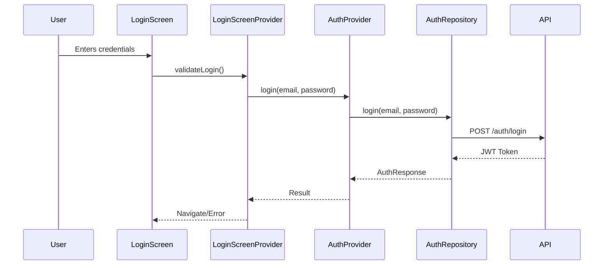

# Authentication Migration Plan: LoginScreen → LoginPassPinScreen

## Executive Summary

This document outlines a comprehensive plan to migrate authentication logic from [`LoginScreen`](lib/connection/login_screen/login_screen.dart) to [`LoginPassPinScreen`](lib/connection/login_pass_pin_screen/login_pass_pin_screen.dart). The goal is to extract reusable authentication components, avoid code duplication, and ensure a maintainable architecture.

---

## 1. Current Architecture Analysis

### 1.1 Existing Components

| Component | Location | Purpose |
|-----------|----------|---------|
| [`LoginScreen`](lib/connection/login_screen/login_screen.dart) | UI layer | Password-based login screen |
| [`LoginScreenProvider`](lib/connection/login_screen/provider/login_screen_provider.dart) | State management | Login business logic |
| [`LoginScreenModel`](lib/connection/login_screen/models/login_screen_model.dart) | Data model | Login form data |
| [`AuthProvider`](lib/core/provider/auth_provider.dart) | Global state | Authentication state |
| [`AuthRepository`](lib/core/repository/auth_repository.dart) | Data layer | API calls for authentication |

### 1.2 Authentication Flow Diagram



---

## 2. Issues Identified in LoginPassPinScreen

### 2.1 Critical Issues

1. **Missing Password Validation**: [`LoginPassPinProvider`](lib/connection/login_pass_pin_screen/provider/login_pass_pin_provider.dart) lacks password validation logic
2. **No Error Handling**: Error display logic is incomplete in [`LoginPassPinScreen`](lib/connection/login_pass_pin_screen/login_pass_pin_screen.dart)
3. **Navigation Issues**: `navigateToHome()` method contains commented-out code
4. **Missing Translation Constants**: No translation keys for error messages
5. **Incomplete Model**: [`LoginPassPinModel`](lib/connection/login_pass_pin_screen/models/login_pass_pin_model.dart) lacks validation fields

### 2.2 Comparison: LoginScreenProvider vs LoginPassPinProvider

| Feature | LoginScreenProvider | LoginPassPinProvider |
|---------|--------------------|--------------------|
| Email validation | ✅ Complete | ❌ Missing |
| Password validation | ✅ Complete | ❌ Missing |
| Error handling | ✅ Full | ⚠️ Partial |
| Loading state | ✅ Yes | ✅ Yes |
| Remember me | ✅ Yes | ❌ Missing |

---

## 3. Recommended Architectural Approach

### 3.1 Strategy: Shared Authentication Service

Extract common authentication logic into a reusable service layer to avoid code duplication:

```dart
// lib/core/services/auth_service.dart
class AuthService {
  final AuthRepository _authRepository;
  final AuthProvider _authProvider;

  AuthService(this._authRepository, this._authProvider);

  Future<AuthResult> login({
    required String email,
    required String password,
    bool rememberMe = false,
  }) async {
    // Validate inputs
    final emailError = _validateEmail(email);
    if (emailError != null) {
      return AuthResult.error(emailError);
    }

    final passwordError = _validatePassword(password);
    if (passwordError != null) {
      return AuthResult.error(passwordError);
    }

    try {
      final response = await _authRepository.login(email, password);
      await _authProvider.setAuthData(
        token: response.token,
        refreshToken: response.refreshToken,
        userData: response.user,
        rememberMe: rememberMe,
      );
      return AuthResult.success();
    } catch (e) {
      return AuthResult.error(_handleError(e));
    }
  }

  String? _validateEmail(String email) {
    if (email.isEmpty) {
      return TranslationConstants.emailRequired;
    }
    if (!RegExp(r'^[^@]+@[^@]+\.[^@]+').hasMatch(email)) {
      return TranslationConstants.invalidEmail;
    }
    return null;
  }

  String? _validatePassword(String password) {
    if (password.isEmpty) {
      return TranslationConstants.passwordRequired;
    }
    if (password.length < 6) {
      return TranslationConstants.passwordTooShort;
    }
    return null;
  }

  String _handleError(dynamic error) {
    if (error is ApiException) {
      switch (error.statusCode) {
        case 401:
          return TranslationConstants.invalidCredentials;
        case 500:
          return TranslationConstants.serverError;
        default:
          return TranslationConstants.loginFailed;
      }
    }
    return TranslationConstants.loginFailed;
  }
}
```

### 3.2 Reusable Components

#### 3.2.1 Validation Mixin

```dart
// lib/core/mixins/validation_mixin.dart
mixin ValidationMixin {
  String? validateEmail(String? value) {
    if (value == null || value.isEmpty) {
      return TranslationConstants.emailRequired;
    }
    if (!RegExp(r'^[^@]+@[^@]+\.[^@]+').hasMatch(value)) {
      return TranslationConstants.invalidEmail;
    }
    return null;
  }

  String? validatePassword(String? value) {
    if (value == null || value.isEmpty) {
      return TranslationConstants.passwordRequired;
    }
    if (value.length < 6) {
      return TranslationConstants.passwordTooShort;
    }
    return null;
  }

  String? validatePin(String? value) {
    if (value == null || value.isEmpty) {
      return TranslationConstants.pinRequired;
    }
    if (value.length != 4) {
      return TranslationConstants.pinInvalidLength;
    }
    if (!RegExp(r'^\d+$').hasMatch(value)) {
      return TranslationConstants.pinNumericOnly;
    }
    return null;
  }
}
```

#### 3.2.2 Error Display Widget

```dart
// lib/widgets/custom_error_message.dart
class CustomErrorMessage extends StatelessWidget {
  final String message;
  final VoidCallback? onDismiss;

  const CustomErrorMessage({
    super.key,
    required this.message,
    this.onDismiss,
  });

  @override
  Widget build(BuildContext context) {
    return Container(
      padding: EdgeInsets.symmetric(horizontal: 16.h, vertical: 12.v),
      decoration: BoxDecoration(
        color: appTheme.errorContainer,
        borderRadius: BorderRadius.circular(8.h),
      ),
      child: Row(
        children: [
          Expanded(
            child: Text(
              message,
              style: TextStyleHelper.bodyMedium.copyWith(
                color: appTheme.onErrorContainer,
              ),
            ),
          ),
          if (onDismiss != null)
            GestureDetector(
              onTap: onDismiss,
              child: Icon(
                Icons.close,
                color: appTheme.onErrorContainer,
                size: 20.h,
              ),
            ),
        ],
      ),
    );
  }
}
```

---

## 4. Step-by-Step Migration Strategy

### Phase 1: Fix LoginPassPinProvider

**File**: [`lib/connection/login_pass_pin_screen/provider/login_pass_pin_provider.dart`](lib/connection/login_pass_pin_screen/provider/login_pass_pin_provider.dart)

#### Current Issues:
- Missing validation methods
- Incomplete `loginWithPassOrPin()` method
- No error state management

#### Solution:

```dart
// Updated LoginPassPinProvider
class LoginPassPinProvider extends ChangeNotifier with ValidationMixin {
  LoginPassPinModel loginPassPinModel = LoginPassPinModel();

  bool _isLoading = false;
  bool _showPassword = false;
  String? _emailError;
  String? _passwordError;

  bool get isLoading => _isLoading;
  bool get showPassword => _showPassword;
  String? get emailError => _emailError;
  String? get passwordError => _passwordError;

  void togglePasswordVisibility() {
    _showPassword = !_showPassword;
    notifyListeners();
  }

  void setEmail(String email) {
    loginPassPinModel.email = email;
    _emailError = null;
    notifyListeners();
  }

  void setPassword(String password) {
    loginPassPinModel.password = password;
    _passwordError = null;
    notifyListeners();
  }

  void setRememberMe(bool value) {
    loginPassPinModel.rememberMe = value;
    notifyListeners();
  }

  void clearErrors() {
    _emailError = null;
    _passwordError = null;
    notifyListeners();
  }

  Future<void> loginWithPassOrPin(BuildContext context) async {
    clearErrors();

    // Validate inputs
    _emailError = validateEmail(loginPassPinModel.email);
    if (_emailError != null) {
      notifyListeners();
      return;
    }

    _passwordError = validatePassword(loginPassPinModel.password);
    if (_passwordError != null) {
      notifyListeners();
      return;
    }

    _isLoading = true;
    notifyListeners();

    try {
      final authProvider = context.read<AuthProvider>();
      final result = await authProvider.login(
        loginPassPinModel.email!,
        loginPassPinModel.password!,
        rememberMe: loginPassPinModel.rememberMe ?? false,
      );

      if (result) {
        _navigateToHome(context);
      } else {
        _showLoginError(context);
      }
    } catch (e) {
      _handleException(context, e);
    } finally {
      _isLoading = false;
      notifyListeners();
    }
  }

  void _navigateToHome(BuildContext context) {
    NavigatorService.pushNamedAndRemoveUntil(
      AppRoutes.accountDashboardScreen,
    );
  }

  void _showLoginError(BuildContext context) {
    ScaffoldMessenger.of(context).showSnackBar(
      SnackBar(
        content: Text(
          TranslationConstants.loginFailed,
          style: TextStyleHelper.bodyMedium.copyWith(
            color: appTheme.onError,
          ),
        ),
        backgroundColor: appTheme.error,
      ),
    );
  }

  void _handleException(BuildContext context, dynamic exception) {
    String message;
    if (exception is ApiException) {
      message = _getErrorMessage(exception);
    } else {
      message = TranslationConstants.loginFailed;
    }

    ScaffoldMessenger.of(context).showSnackBar(
      SnackBar(
        content: Text(
          message,
          style: TextStyleHelper.bodyMedium.copyWith(
            color: appTheme.onError,
          ),
        ),
        backgroundColor: appTheme.error,
      ),
    );
  }

  String _getErrorMessage(ApiException exception) {
    switch (exception.statusCode) {
      case 401:
        return TranslationConstants.invalidCredentials;
      case 500:
        return TranslationConstants.serverError;
      default:
        return TranslationConstants.loginFailed;
    }
  }

  @override
  void dispose() {
    super.dispose();
  }
}
```

### Phase 2: Fix LoginPassPinScreen

**File**: [`lib/connection/login_pass_pin_screen/login_pass_pin_screen.dart`](lib/connection/login_pass_pin_screen/login_pass_pin_screen.dart)

#### Current Issues:
- Missing error display widgets
- No remember me checkbox
- Incorrect navigation logic

#### Solution:

```dart
// Updated LoginPassPinScreen
class LoginPassPinScreen extends StatefulWidget {
  static Widget builder(BuildContext context) {
    return ChangeNotifierProvider<LoginPassPinProvider>(
      create: (context) => LoginPassPinProvider(),
      child: LoginPassPinScreen(),
    );
  }

  @override
  State<LoginPassPinScreen> createState() => _LoginPassPinScreenState();
}

class _LoginPassPinScreenState extends State<LoginPassPinScreen> {
  final _formKey = GlobalKey<FormState>();

  @override
  void initState() {
    super.initState();
    WidgetsBinding.instance.addPostFrameCallback((_) {
      context.read<LoginPassPinProvider>().initialize();
    });
  }

  @override
  Widget build(BuildContext context) {
    return Scaffold(
      body: SafeArea(
        child: Consumer<LoginPassPinProvider>(
          builder: (context, provider, child) {
            return Form(
              key: _formKey,
              child: Column(
                children: [
                  Expanded(
                    child: SingleChildScrollView(
                      padding: EdgeInsets.symmetric(horizontal: 16.h),
                      child: Column(
                        crossAxisAlignment: CrossAxisAlignment.start,
                        children: [
                          SizedBox(height: 40.v),
                          _buildLogoSection(),
                          SizedBox(height: 24.v),
                          _buildTitleSection(),
                          SizedBox(height: 8.v),
                          _buildSubtitleSection(),
                          SizedBox(height: 32.v),
                          _buildEmailField(provider),
                          SizedBox(height: 16.v),
                          _buildPasswordField(provider),
                          SizedBox(height: 16.v),
                          _buildRememberMeRow(provider),
                          SizedBox(height: 24.v),
                          _buildLoginButton(context, provider),
                          SizedBox(height: 24.v),
                          _buildForgotPasswordLink(),
                        ],
                      ),
                    ),
                  ),
                  _buildFooterLinks(),
                ],
              ),
            );
          },
        ),
      ),
    );
  }

  Widget _buildLogoSection() {
    return Center(
      child: CustomImageView(
        imagePath: ImageConstant.imgMillimeLogo,
        height: 80.v,
        width: 200.h,
      ),
    );
  }

  Widget _buildTitleSection() {
    return Text(
      TranslationConstants.welcomeBack,
      style: TextStyleHelper.headlineMedium.copyWith(
        color: appTheme.onBackground,
      ),
    );
  }

  Widget _buildSubtitleSection() {
    return Text(
      TranslationConstants.loginSubtitle,
      style: TextStyleHelper.bodyMedium.copyWith(
        color: appTheme.onSurfaceVariant,
      ),
    );
  }

  Widget _buildEmailField(LoginPassPinProvider provider) {
    return Column(
      crossAxisAlignment: CrossAxisAlignment.start,
      children: [
        Text(
          TranslationConstants.email,
          style: TextStyleHelper.labelLarge.copyWith(
            color: appTheme.onBackground,
          ),
        ),
        SizedBox(height: 8.v),
        CustomTextFormField(
          controller: TextEditingController(text: provider.loginPassPinModel.email),
          hintText: TranslationConstants.emailHint,
          textInputType: TextInputType.emailAddress,
          prefix: Container(
            margin: EdgeInsets.symmetric(horizontal: 16.h, vertical: 16.v),
            child: CustomImageView(
              imagePath: ImageConstant.imgMail,
              height: 24.h,
              width: 24.h,
            ),
          ),
          onChanged: (value) => provider.setEmail(value),
          errorText: provider.emailError,
        ),
      ],
    );
  }

  Widget _buildPasswordField(LoginPassPinProvider provider) {
    return Column(
      crossAxisAlignment: CrossAxisAlignment.start,
      children: [
        Text(
          TranslationConstants.password,
          style: TextStyleHelper.labelLarge.copyWith(
            color: appTheme.onBackground,
          ),
        ),
        SizedBox(height: 8.v),
        CustomTextFormField(
          controller: TextEditingController(text: provider.loginPassPinModel.password),
          hintText: TranslationConstants.passwordHint,
          obscureText: !provider.showPassword,
          prefix: Container(
            margin: EdgeInsets.symmetric(horizontal: 16.h, vertical: 16.v),
            child: CustomImageView(
              imagePath: ImageConstant.imgLock,
              height: 24.h,
              width: 24.h,
            ),
          ),
          suffix: GestureDetector(
            onTap: () => provider.togglePasswordVisibility(),
            child: CustomImageView(
              imagePath: provider.showPassword
                  ? ImageConstant.imgEyeSlash
                  : ImageConstant.imgEye,
              height: 24.h,
              width: 24.h,
            ),
          ),
          onChanged: (value) => provider.setPassword(value),
          errorText: provider.passwordError,
        ),
      ],
    );
  }

  Widget _buildRememberMeRow(LoginPassPinProvider provider) {
    return Row(
      children: [
        Checkbox(
          value: provider.loginPassPinModel.rememberMe ?? false,
          onChanged: (value) => provider.setRememberMe(value ?? false),
          activeColor: appTheme.primaryColor,
        ),
        SizedBox(width: 8.h),
        Text(
          TranslationConstants.rememberMe,
          style: TextStyleHelper.bodyMedium.copyWith(
            color: appTheme.onBackground,
          ),
        ),
      ],
    );
  }

  Widget _buildLoginButton(BuildContext context, LoginPassPinProvider provider) {
    return SizedBox(
      width: double.maxFinite,
      child: ElevatedButton(
        onPressed: provider.isLoading
            ? null
            : () => provider.loginWithPassOrPin(context),
        child: provider.isLoading
            ? SizedBox(
                height: 24.h,
                width: 24.h,
                child: CircularProgressIndicator(
                  strokeWidth: 2.h,
                  color: appTheme.onPrimary,
                ),
              )
            : Text(
                TranslationConstants.login,
                style: TextStyleHelper.titleMediumSemiBold.copyWith(
                  color: appTheme.onPrimary,
                ),
              ),
      ),
    );
  }

  Widget _buildForgotPasswordLink() {
    return Center(
      child: GestureDetector(
        onTap: () {
          NavigatorService.pushNamed(AppRoutes.passwordUpdateScreen);
        },
        child: Text(
          TranslationConstants.forgotPassword,
          style: TextStyleHelper.bodyMedium.copyWith(
            color: appTheme.primaryColor,
            decoration: TextDecoration.underline,
          ),
        ),
      ),
    );
  }

  Widget _buildFooterLinks() {
    return Container(
      width: double.maxFinite,
      padding: EdgeInsets.symmetric(vertical: 16.v),
      decoration: BoxDecoration(
        color: appTheme.surfaceColor,
        border: Border(
          top: BorderSide(color: appTheme.dividerColor),
        ),
      ),
      child: Row(
        mainAxisAlignment: MainAxisAlignment.center,
        children: [
          Text(
            TranslationConstants.dontHaveAccount,
            style: TextStyleHelper.bodyMedium.copyWith(
              color: appTheme.onSurfaceVariant,
            ),
          ),
          SizedBox(width: 4.h),
          GestureDetector(
            onTap: () {
              NavigatorService.pushNamed(AppRoutes.accountTypeSelectionScreen);
            },
            child: Text(
              TranslationConstants.signUp,
              style: TextStyleHelper.bodyMediumSemiBold.copyWith(
                color: appTheme.primaryColor,
              ),
            ),
          ),
        ],
      ),
    );
  }
}
```

### Phase 3: Update LoginPassPinModel

**File**: [`lib/connection/login_pass_pin_screen/models/login_pass_pin_model.dart`](lib/connection/login_pass_pin_screen/models/login_pass_pin_model.dart)

```dart
// Updated LoginPassPinModel
class LoginPassPinModel {
  String? email;
  String? password;
  bool? rememberMe;
  String? pin;

  LoginPassPinModel({
    this.email,
    this.password,
    this.rememberMe,
    this.pin,
  }) {
    email = email ?? '';
    password = password ?? '';
    rememberMe = rememberMe ?? false;
    pin = pin ?? '';
  }

  bool get isValid {
    final emailValid = email != null && email!.isNotEmpty;
    final passwordValid = password != null && password!.length >= 6;
    return emailValid && passwordValid;
  }

  bool get hasPinOnly {
    return pin != null && pin!.length == 4 && (email?.isEmpty ?? true);
  }

  void clear() {
    email = '';
    password = '';
    rememberMe = false;
    pin = '';
  }
}
```

---

## 5. Testing Considerations

### 5.1 Unit Tests for Validation

```dart
// test/validation_mixin_test.dart
void main() {
  group('ValidationMixin Tests', () {
    late TestProvider provider;

    setUp(() {
      provider = TestProvider();
    });

    test('validateEmail returns error for empty email', () {
      final result = provider.validateEmail('');
      expect(result, equals(TranslationConstants.emailRequired));
    });

    test('validateEmail returns error for invalid email format', () {
      final result = provider.validateEmail('invalid');
      expect(result, equals(TranslationConstants.invalidEmail));
    });

    test('validateEmail returns null for valid email', () {
      final result = provider.validateEmail('test@example.com');
      expect(result, isNull);
    });

    test('validatePassword returns error for empty password', () {
      final result = provider.validatePassword('');
      expect(result, equals(TranslationConstants.passwordRequired));
    });

    test('validatePassword returns error for short password', () {
      final result = provider.validatePassword('123');
      expect(result, equals(TranslationConstants.passwordTooShort));
    });

    test('validatePassword returns null for valid password', () {
      final result = provider.validatePassword('password123');
      expect(result, isNull);
    });

    test('validatePin returns error for empty pin', () {
      final result = provider.validatePin('');
      expect(result, equals(TranslationConstants.pinRequired));
    });

    test('validatePin returns error for invalid length', () {
      final result = provider.validatePin('12345');
      expect(result, equals(TranslationConstants.pinInvalidLength));
    });

    test('validatePin returns error for non-numeric pin', () {
      final result = provider.validatePin('12ab');
      expect(result, equals(TranslationConstants.pinNumericOnly));
    });

    test('validatePin returns null for valid pin', () {
      final result = provider.validatePin('1234');
      expect(result, isNull);
    });
  });
}

class TestProvider with ValidationMixin {}
```

### 5.2 Widget Tests for LoginPassPinScreen

```dart
// test/login_pass_pin_screen_test.dart
void main() {
  testWidgets('LoginPassPinScreen displays email and password fields',
      (WidgetTester tester) async {
    await tester.pumpWidget(
      MaterialApp(
        home: LoginPassPinScreen.builder(),
      ),
    );

    expect(find.text('Email'), findsOneWidget);
    expect(find.text('Password'), findsOneWidget);
    expect(find.text('Login'), findsOneWidget);
  });

  testWidgets('Login button is enabled when fields are valid',
      (WidgetTester tester) async {
    await tester.pumpWidget(
      MaterialApp(
        home: LoginPassPinScreen.builder(),
      ),
    );

    final loginButton = find.byType(ElevatedButton);
    expect(loginButton, findsOneWidget);
  });

  testWidgets('Error message appears for invalid email',
      (WidgetTester tester) async {
    await tester.pumpWidget(
      MaterialApp(
        home: LoginPassPinScreen.builder(),
      ),
    );

    // Enter invalid email and trigger validation
    await tester.enterText(
      find.byType(CustomTextFormField).first,
      'invalid',
    );

    await tester.pump();

    // Verify error state
    expect(find.text(TranslationConstants.invalidEmail), findsOneWidget);
  });
}
```

### 5.3 Integration Tests

```dart
// test/auth_service_integration_test.dart
void main() {
  group('AuthService Integration Tests', () {
    late AuthService authService;
    late MockAuthRepository mockRepository;
    late MockAuthProvider mockProvider;

    setUp(() {
      mockRepository = MockAuthRepository();
      mockProvider = MockAuthProvider();
      authService = AuthService(mockRepository, mockProvider);
    });

    test('login with valid credentials returns success', () async {
      final result = await authService.login(
        email: 'test@example.com',
        password: 'password123',
      );

      expect(result.isSuccess, isTrue);
    });

    test('login with invalid credentials returns error', () async {
      mockRepository.mockLoginFailure(401);

      final result = await authService.login(
        email: 'test@example.com',
        password: 'wrongpassword',
      );

      expect(result.isError, isTrue);
      expect(result.errorMessage, TranslationConstants.invalidCredentials);
    });

    test('login with empty email returns validation error', () async {
      final result = await authService.login(
        email: '',
        password: 'password123',
      );

      expect(result.isError, isTrue);
      expect(result.errorMessage, TranslationConstants.emailRequired);
    });
  });
}
```

---

## 6. Migration Checklist

| Task | Priority | Status |
|------|----------|--------|
| Create AuthService class | High | ⏳ Pending |
| Create ValidationMixin | High | ⏳ Pending |
| Update LoginPassPinProvider | High | ⏳ Pending |
| Update LoginPassPinScreen | High | ⏳ Pending |
| Update LoginPassPinModel | Medium | ⏳ Pending |
| Create CustomErrorMessage widget | Medium | ⏳ Pending |
| Add translation constants | High | ⏳ Pending |
| Write unit tests | High | ⏳ Pending |
| Write widget tests | Medium | ⏳ Pending |
| Write integration tests | Medium | ⏳ Pending |

---

## 7. Estimated Effort

| Phase | Complexity | Files to Modify |
|-------|------------|-----------------|
| Phase 1: Provider Fix | Medium | 1 file |
| Phase 2: Screen Fix | Medium | 1 file |
| Phase 3: Model Update | Low | 1 file |
| Phase 4: Testing | Medium | 4+ files |

---

## 8. Rollback Plan

If issues arise after migration:

1. Keep `LoginScreen` as fallback option
2. Use feature flags to toggle between login methods
3. Monitor error rates in production for 48 hours before fully switching
