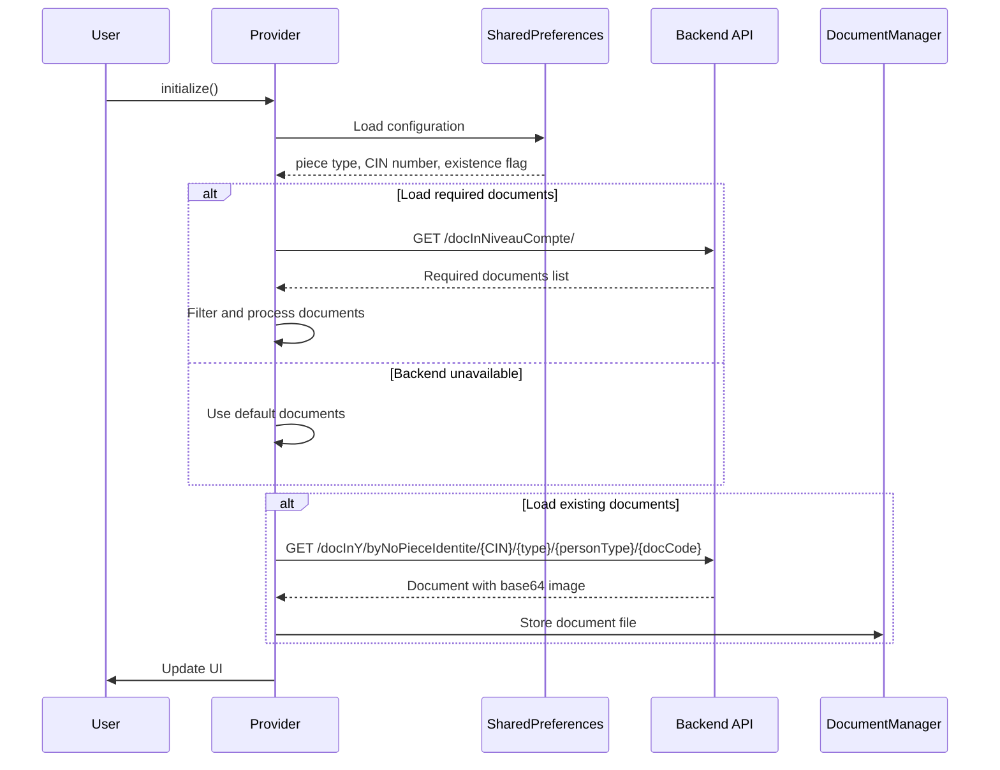
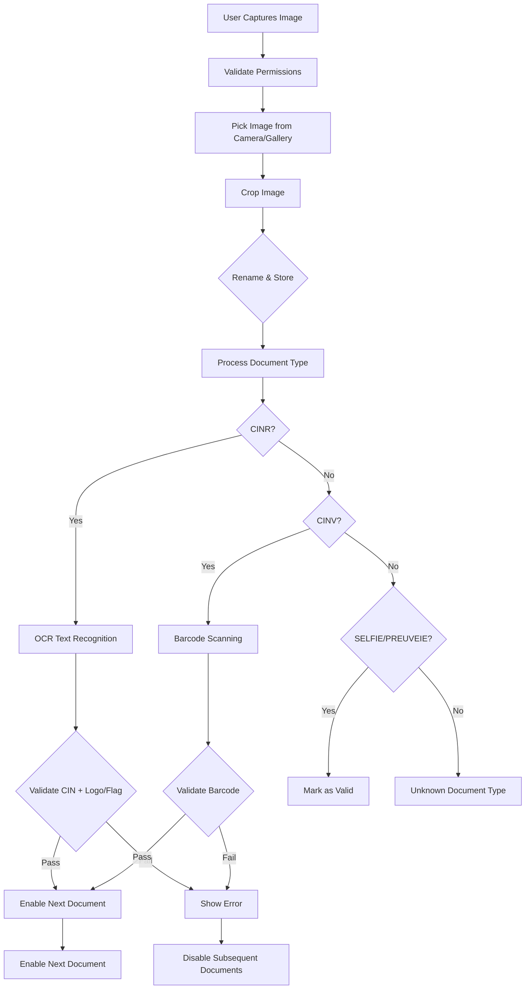

# Document Loading Analysis for IdentityVerificationMandProvider

## Overview

This document provides a comprehensive analysis of the document loading functionality in the `IdentityVerificationMandProvider` class, specifically focusing on the `loadDocuments()` and `loadDocsOfPpMand()` methods. This system manages the loading, validation, and storage of required identity documents for mandate persons in a mobile banking application.

## Architecture Components

### 1. Core Classes and Models

#### IdentityVerificationMandProvider
- **Location**: `lib/presentation/identity_verification_mand_screen/provider/identity_verification_mand_provider.dart`
- **Purpose**: Manages state and business logic for identity verification of mandate persons
- **Key Features**:
  - Document loading and validation
  - Image processing (OCR, barcode scanning)
  - State management for UI components
  - Integration with backend APIs

#### IdentityVerificationMandModel
- **Location**: `lib/presentation/identity_verification_mand_screen/models/identity_verification_mand_model.dart`
- **Purpose**: Data model for identity verification state
- **Key Properties**:
  - `docManquants`: List of required document codes
  - `mandimages`: List of captured image paths
  - `enableDocButton`: Map controlling which documents can be captured
  - `documentsRequis`: List of required documents from backend
  - `selectedPieceType`: Currently selected piece type (CIN/Passport)

#### DocumentRequis & PieceIdentite Models
- **Purpose**: Represent required documents and piece identification types
- **Backend Integration**: Maps to API response structure

### 2. Supporting Utilities

#### DocumentManager
- **Location**: `lib/core/utils/document_manager.dart`
- **Purpose**: Handles document file operations and storage
- **Key Functions**:
  - `storeDocumentsWithCodes()`: Stores documents with their codes
  - `renameAndStoreDocument()`: Standardizes document filenames
  - `loadDocumentsWithCodes()`: Loads stored documents

#### Functions
- **Location**: `lib/core/utils/functions.dart`
- **Purpose**: Contains API integration functions
- **Key Functions**:
  - `fetchDocInYByNoPieceIdentite()`: Retrieves existing documents from backend
  - `fetchPersonnePbyPieceIdentite()`: Retrieves person data

## Method Analysis

### 1. loadDocuments() Method

**Purpose**: Loads required documents based on account configuration and user selection.

**Location**: Lines 256-348 in IdentityVerificationMandProvider

**Flow Diagram**:
```
Initialize → Load Preferences → Call Backend API → Process Response → Update Model → Handle Fallback → Notify UI
```

**Key Steps**:
1. **Initialization** (Lines 258-261)
   - Sets loading state with user message
   - Clears previous states

2. **Configuration Loading** (Lines 263-279)
   - Loads selected account type from SharedPreferences
   - Determines if signataireEtTitulaire (false for mandate persons)
   - Calls `_chargerDocInRequisNvCompte()` with parameters:
     - `signataireEtTitulaire: false` (mandate person)
     - `niveau`: Account level (Niveau1/Niveau2)
     - `pp`: Is physical person (true/false)

3. **Backend API Integration** (Lines 920-1031)
   - Makes HTTP GET request to `/docInNiveauCompte/`
   - Filters documents based on:
     - Account level match
     - Document applicability to mandate persons (`docInBoolLignePpMand != 'N'`)
     - Operation type (nouveau compte)
   - Applies piece type filtering if selected

4. **Model Updates** (Lines 281-317)
   - Updates `documentsRequis` with backend response
   - Creates `docManquants` list from document codes
   - Initializes `mandimages` array
   - Sets up `enableDocButton` map (only first document enabled)
   - Resets legacy disable flags for backward compatibility

5. **Error Handling & Fallback** (Lines 318-347)
   - Catches API errors and network issues
   - Falls back to default documents: `['CINR', 'CINV', 'SELFIE']`
   - Sets backend error flags for UI notification
   - Provides user-friendly error messages

**Configuration Logic**:
```dart
// For mandate persons (pp = true), filter by docInBoolLignePpMand
filtredDocInNivComptes = docInNivComptes?.where(
  (e) =>
      e['niveauCompte']['niveauCompteDsg'] == niveau &&
      e['docIn']['docInBoolLignePpMand'] != 'N' &&
      e['operation']['operationCode'] == CODE_OPERATION_NOUVELLE_COMPTE,
).toList();
```

### 2. loadDocsOfPpMand() Method

**Purpose**: Loads existing documents for a mandate person who already exists in the database.

**Location**: Lines 179-254 in IdentityVerificationMandProvider

**Flow Diagram**:
```
Initialize → Loop Through Required Docs → Fetch Each Document → Decode Response → Store Image → Update Disable States → Notify UI
```

**Key Steps**:
1. **Parameter Processing** (Line 179)
   - `selectedValueTypePiece`: Type of identification (CIN/Passport)
   - `numPieceMand`: Identification number

2. **Document Loop** (Lines 187-250)
   - Iterates through `docManquants` list
   - For each document type, calls `fetchDocInYByNoPieceIdentite()`
   - Parameters: `numPieceMand`, `selectedValueTypePiece`, `'P'`, `docManquants[i]`

3. **API Response Processing** (Lines 195-244)
   - Decodes JSON response containing document info and base64 image
   - Extracts `docincode` from response
   - Creates file with standardized naming: `{docincode}.png`
   - Decodes base64 image and writes to file
   - Stores file path in `mandimages` array

4. **State Management** (Lines 212-243)
   - Updates disable flags based on document types:
     - `CINR`: Sets `disableCINRMand = true`
     - `CINV`: Sets `disableCINVMand = true`
     - `SELFIE`: Sets `disableSELFIEMand = false` and enables button
     - `PROCB`: Sets `disablePROCB = false` and enables button

5. **UI Notification** (Lines 251-252)
   - Calls `notifyListeners()` to update UI
   - Adds delay for UI consistency

**API Integration**:
```dart
final response = await http.get(Uri.parse(
    'http://${BACKEND_SERVER}:8081/docInY/byNoPieceIdentite/' +
        numPiece +
        '/' +
        codePiece +
        '/' +
        typePersonne +
        '/' +
        codeDocinX));
```

**Document Type Handling**:
- **CINR/CINV**: Mark as disabled (already captured)
- **SELFIE**: Enable button for new capture
- **PROCB**: Enable button for new capture

### 3. Integration Points

#### Initialization Flow (Lines 149-177)
```dart
void initialize() async {
  // Load configuration from SharedPreferences
  String? personalMandTypePiece = prefs.getString('personal_mand_type_piece');
  String? enteredCinNumber = prefs.getString('personal_mand_numero_piece');
  bool mandExist = prefs.getBool('personne_mand_exist') ?? false;

  // Always load required documents
  await loadDocuments();

  // If mandate person exists, load their existing documents
  if (mandExist) {
    await loadDocsOfPpMand(personalMandTypePiece!, enteredCinNumber!);
  }

  notifyListeners();
}
```

#### State Dependencies
- **CIN Validation**: Selfie and proof of life documents only enabled after CIN validation
- **Piece Type**: Documents filtered based on selected identification type
- **Existence Check**: Existing documents loaded only if mandate person already exists

## Data Flow

### 1. Document Loading Sequence



### 2. Document Processing Flow



## Error Handling & Fallback Mechanisms

### 1. Backend API Failures

**loadDocuments() Fallback**:
- **Trigger**: Network error, server unavailable, invalid response
- **Action**: Use default documents `['CINR', 'CINV', 'SELFIE']`
- **User Impact**: Shows backend error message
- **State**: Sets `backendError = true`

**loadDocsOfPpMand() Fallback**:
- **Trigger**: Individual document fetch fails
- **Action**: Continues with remaining documents
- **User Impact**: Missing documents appear as not captured

### 2. Document Validation Errors

**CINR Validation**:
- **Requirements**: Logo/flag detection + 8-digit CIN text
- **Failure Actions**:
  - Disable subsequent documents
  - Show specific error message
  - Reset CIN validation state

**CINV Validation**:
- **Requirements**: Barcode detection + matches CINR
- **Failure Actions**:
  - Disable subsequent documents  
  - Show mismatch error message
  - Reset piece ID verification

### 3. File System Errors

**Image Storage**:
- **Errors**: Permission denied, disk full, corrupted files
- **Handling**: Fallback to original file path
- **Recovery**: User can recapture image

## State Management

### 1. Document Button States

**enableDocButton Map**:
- Controls which documents can be captured
- Only one document enabled at a time (sequential flow)
- Updates based on validation results

**Disable Flags** (Legacy Support):
- `disableCINR`, `disableCINV`, `disableSELFIE`, `disablePreuveDeVie`
- Maintained for backward compatibility
- Used by UI components

### 2. Validation States

**CIN Validation**:
- `cinValidationPassed`: Boolean flag
- Updated after CINR processing
- Required for enabling selfie/proof documents

**Piece ID Verification**:
- `pieceIdVerifiee`: Boolean flag  
- Updated after CINV barcode processing
- Used for document flow control

### 3. UI State Management

**Processing States**:
- `isProcessingImage`: Overall processing flag
- `processingMessage`: User feedback message
- `processingDocumentIndex`: Current document being processed

**Preview States**:
- `showPreview`: Map of document index to preview visibility
- Updated when user toggles preview

## Security Considerations

### 1. Data Storage

**Local Storage**:
- Documents stored in application directory
- Filenames use document codes (no personal information)
- Paths separated by prefix ('titu' vs 'mand')

**SharedPreferences**:
- Only stores file paths, not sensitive data
- CIN numbers stored for validation purposes
- Flags and states stored for session continuity

### 2. Network Security

**API Communication**:
- Uses HTTP (should be HTTPS in production)
- Base64 encoding for document images
- No encryption for document transmission

### 3. Data Validation

**Input Validation**:
- CIN format validation (8 digits)
- Barcode length validation
- File existence checks before processing

## Performance Considerations

### 1. Image Processing

**Optimization Strategies**:
- Image cropping with compression (85% quality)
- Parallel processing for logo/flag detection
- Efficient memory management with proper disposal

### 2. Network Requests

**Batching**:
- Single request for required documents list
- Individual requests for existing documents
- Proper error handling to avoid blocking

### 3. State Updates

**Notification Strategy**:
- Batch updates where possible
- Minimize unnecessary `notifyListeners()` calls
- Use `addPostFrameCallback` for UI-dependent operations

## Integration Points

### 1. SharedPreferences Keys

**Configuration**:
- `personal_mand_type_piece`: Selected piece type
- `personal_mand_numero_piece`: CIN/Passport number
- `personne_mand_exist`: Existence flag

**Document Storage**:
- `mand_identity_document_images`: Image paths
- `mand_identity_document_codes`: Document codes

### 2. Navigation Flow

**Route Dependencies**:
- Loads configuration from previous screens
- Provides data to subsequent screens
- Integrates with account type selection

### 3. Backend API Endpoints

**Document Management**:
- `GET /docInNiveauCompte/`: Required documents
- `GET /docInY/byNoPieceIdentite/{num}/{type}/{personType}/{doc}`: Existing documents
- `POST /` (port 5000): Logo/flag detection service

## Improvement Opportunities

### 1. Code Organization

**Issues**:
- Large provider class (>1300 lines)
- Mixed responsibilities (UI, business logic, API)
- Hardcoded constants throughout

**Recommendations**:
- Split into smaller, focused classes
- Extract API services to separate module
- Move constants to configuration file
- Implement proper dependency injection

### 2. Error Handling

**Issues**:
- Generic error messages
- Limited recovery options
- Inconsistent error state management

**Recommendations**:
- Implement specific error types
- Add retry mechanisms
- Improve user feedback
- Add logging for debugging

### 3. Performance

**Issues**:
- Sequential document loading
- No caching of API responses
- Inefficient image processing

**Recommendations**:
- Implement document caching
- Parallel document loading where possible
- Optimize image processing pipeline
- Add loading indicators

### 4. Security

**Issues**:
- HTTP communication
- Base64 document transmission
- Local file storage without encryption

**Recommendations**:
- Implement HTTPS communication
- Add document encryption
- Secure file storage with proper permissions
- Add data retention policies

### 5. Testing

**Missing**:
- Unit tests for provider methods
- Integration tests for API calls
- UI tests for document capture flow
- Error scenario testing

**Recommendations**:
- Add comprehensive unit tests
- Implement integration test suite
- Add UI automation tests
- Create test fixtures for document processing

## Conclusion

The current document loading system provides a solid foundation for identity verification but would benefit from refactoring to improve maintainability, performance, and security. The separation between `loadDocuments()` (for required documents) and `loadDocsOfPpMand()` (for existing documents) is well-designed, though the implementation could be optimized and better organized.

Key strengths:
- Clear separation of concerns
- Comprehensive error handling
- Proper state management
- Good integration with backend APIs

Areas for improvement:
- Code organization and modularity
- Performance optimization
- Security enhancements
- Testing coverage
- User experience refinements