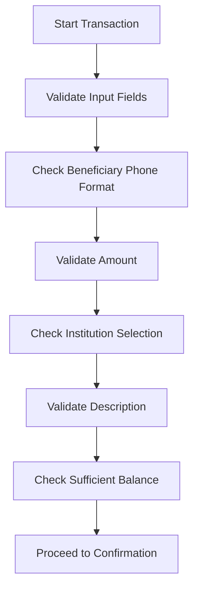

# Transfer Logic Migration Plan

## Overview
This document outlines the migration strategy for transferring business logic from the old Millime app to the new AI-generated app, focusing specifically on the transfer funds functionality.

## Current State Analysis

### Old App Structure
- **Location**: `/data/mime/mobile3/lib/pages/transfertFonds.dart`
- **Key Components**:
  - Transaction validation and processing
  - Commission calculation logic
  - Balance checking and validation
  - Password verification flow
  - API integration with backend services
  - Error handling and user feedback
  - Contact integration for beneficiary selection

### New App Structure
- **Location**: `/data/mime/mobileMelek/me/lib/transactions/transfert/`
- **Current Components**:
  - Basic UI structure with form fields
  - Simple provider pattern implementation
  - Mock data and placeholder logic
  - Missing business validation and processing

## Migration Strategy

### Phase 1: Architecture Alignment
**Objective**: Ensure the new app architecture can support the business logic

1. **Model Enhancement**
   - Extend `TransferModel` to include all required transaction fields
   - Add validation rules and business constraints
   - Implement proper data types and null safety

2. **Provider Integration**
   - Enhance `TransferProvider` with business logic methods
   - Add state management for transaction processing
   - Implement error handling and user feedback

3. **API Service Layer**
   - Create dedicated API service for transaction operations
   - Implement proper HTTP client with authentication
   - Add request/response mapping and error handling

### Phase 2: Core Business Logic Migration

#### 1. Transaction Validation
**Source**: Old app's `processTransaction()` method
**Target**: New app's `TransferProvider.validateTransaction()`



#### 2. Commission Calculation
**Source**: Old app's `buildMsgCommissions()` method
**Target**: New app's `TransferProvider.calculateCommissions()`

Key logic to migrate:
- Dynamic commission calculation based on transaction type
- TVA calculation and formatting
- Currency formatting with proper decimal places
- Institution-specific commission rules

#### 3. Balance Verification
**Source**: Old app's balance checking logic
**Target**: New app's `TransferProvider.checkBalance()`

Implementation approach:
```dart
Future<bool> checkBalance(double amount, double commissions) async {
  final totalAmount = amount + commissions;
  final currentBalance = await getCurrentBalance();
  
  if (currentBalance >= totalAmount) {
    return true;
  } else {
    throw InsufficientBalanceException();
  }
}
```

#### 4. Password Verification
**Source**: Old app's `_showInputDialog()` and password validation
**Target**: New app's authentication integration

Migration approach:
- Integrate with existing auth provider
- Implement secure password verification
- Add proper error handling for failed attempts

### Phase 3: API Integration

#### Backend Service Methods to Implement

1. **Transaction Evaluation**
   - Endpoint: `POST /transfererFond/evaluate`
   - Purpose: Get commission and validation before processing
   - Response: Transaction object with calculated values

2. **Transaction Processing**
   - Endpoint: `POST /transfererFond/process`
   - Purpose: Execute the actual fund transfer
   - Response: Completed transaction with reference

3. **Account Balance**
   - Endpoint: `GET /compte/telgestplus/{tel}`
   - Purpose: Get current account balance
   - Response: Account details with balance

### Phase 4: UI Integration

#### Confirmation Dialog Enhancement
- Add detailed transaction summary
- Include commission breakdown
- Show beneficiary information
- Display balance impact

#### Error Handling Integration
- Add proper error messages for validation failures
- Implement user-friendly error displays
- Add retry mechanisms for failed operations

### Phase 5: Testing and Validation

#### Test Cases to Implement

1. **Basic Transfer Flow**
   - Valid beneficiary, amount, and description
   - Sufficient balance
   - Successful transaction processing

2. **Edge Cases**
   - Insufficient balance
   - Invalid beneficiary phone format
   - Zero or negative amount
   - Missing required fields

3. **Error Scenarios**
   - Network connectivity issues
   - Backend service failures
   - Authentication failures
   - Invalid institution selection

## Implementation Timeline

### Week 1: Foundation Setup
- [ ] Enhance data models
- [ ] Set up API service layer
- [ ] Implement basic validation

### Week 2: Core Logic Migration
- [ ] Migrate commission calculation
- [ ] Implement balance checking
- [ ] Add password verification

### Week 3: API Integration
- [ ] Connect to backend services
- [ ] Implement transaction evaluation
- [ ] Add transaction processing

### Week 4: UI Integration & Testing
- [ ] Enhance confirmation dialogs
- [ ] Add error handling UI
- [ ] Implement comprehensive testing

## Risk Assessment

### Potential Risks
1. **API Compatibility Issues**: Old vs new API contracts
2. **Authentication Differences**: Different auth mechanisms
3. **Data Model Mismatches**: Field naming and structure differences
4. **Performance Impact**: Complex calculations on mobile devices

### Mitigation Strategies
1. **API Adapter Pattern**: Create compatibility layer
2. **Progressive Integration**: Test each component separately
3. **Comprehensive Testing**: Unit, integration, and UI tests
4. **Performance Optimization**: Profile and optimize critical paths

## Success Criteria

1. **Functional Parity**: All old app features work in new app
2. **Code Quality**: Clean, maintainable, and well-documented code
3. **Performance**: Equal or better performance than old app
4. **User Experience**: Consistent or improved user flow
5. **Test Coverage**: Comprehensive test suite with >90% coverage

## Migration Checklist

- [ ] ✅ Analyze old transfer logic
- [ ] ✅ Examine new app structure
- [ ] 📋 Create detailed migration plan
- [ ] ⏳ Implement business logic migration
- [ ] ⏳ Test and validate functionality
- [ ] ⏳ Document changes and updates
- [ ] ⏳ Train team on new implementation
- [ ] ⏳ Monitor production deployment

## Technical Recommendations

1. **Use Dependency Injection**: For better testability and maintainability
2. **Implement Repository Pattern**: Separate data access from business logic
3. **Add Comprehensive Logging**: For debugging and monitoring
4. **Follow SOLID Principles**: Especially Single Responsibility Principle
5. **Implement Feature Flags**: For gradual rollout and A/B testing

## Appendix: Key Code References

### Old App Key Methods
- `processTransaction()`: Main transaction processing
- `buildMsgCommissions()`: Commission calculation
- `EvaluerTransfererFond()`: Transaction evaluation
- `transfererFond()`: Actual transfer execution

### New App Integration Points
- `TransferProvider.showConfirmation()`: Confirmation flow
- `TransferProvider.validateTransfer()`: Validation logic
- `TransferModel`: Data structure
- `TransferScreen`: UI components